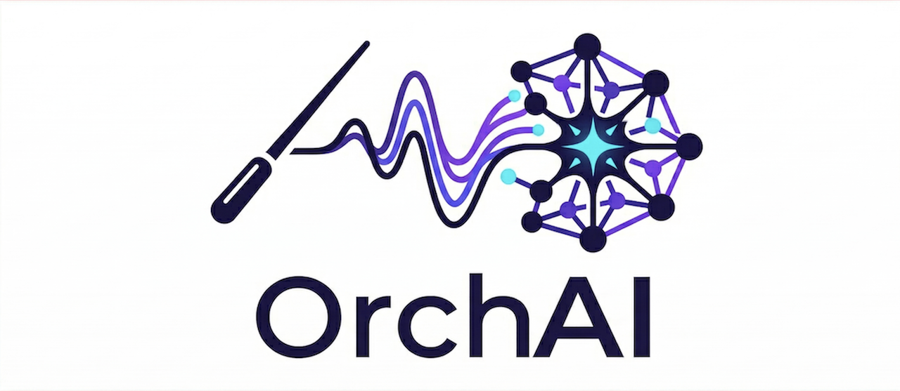

<p align="center">
  
</p>

# orcai-slack

An event-driven framework that connects your Slack workspace to Claude Code (or Cursor) agents running 24/7 on your own infrastructure. Send a message, get code written.

[](https://opensource.org/licenses/MIT)
[](https://www.python.org/downloads/)

Part of the [Quiero Mas AI](https://github.com/quieromas-ai) initiative.

---

## How it works

```
You (or GitHub/Azure DevOps bot) → Slack channel
    ↓  @mention or integration event
  Router (router.py)
    ↓  reads channel, resolves project workspace
  Agent (Claude Code / Cursor)
    ↓  runs autonomously, writes code, opens PRs
  Slack thread reply  ←  result posted back
```

The **router** is a lightweight async Python service connected to Slack via Socket Mode. It listens for `@BotName` mentions and integration bot messages (GitHub, Azure DevOps), spawns a `claude --agent` subprocess in the configured project workspace, and posts the result back to the Slack thread. Thread replies resume the previous Claude session automatically — and if the agent is still working, a follow-up in the same thread is queued and delivered to the running session instead of starting a second agent (see [Follow-up messages while an agent is running](#follow-up-messages-while-an-agent-is-running)).

---

## Repository layout

```
orcai-slack/
├── router/                   # The Slack→agent router service
│   ├── router.py             # Main entry point
│   ├── agent_runner.sh       # Spawns claude / cursor-agent
│   ├── platforms/            # Message parsers (slack, github, azure_devops)
│   ├── tests/                # pytest suite (138 tests)
│   ├── config.example.yaml
│   ├── .env.example
│   └── router.service.example
│
└── projects/                 # Example project workspace — copy & customise
    ├── config.example.yaml
    ├── .env.example
    ├── AGENTS.example.md
    ├── .claude/
    │   ├── settings.json      # inbox-delivery hooks (PostToolUse, Stop)
    │   ├── agents/
    │   │   └── engineer.md    # Software engineer agent example
    │   └── skills/
    │       └── check-inbox/   # poll skill for follow-ups mid-run
    └── .orcai/
        └── hooks/             # inbox_inject.sh, inbox_drain.sh, inbox_emit.py
```

---

## Prerequisites

- **Python 3.10+** (3.12 recommended)
- **Claude Code CLI** (`claude`) — [install guide](https://docs.anthropic.com/en/docs/claude-code)
- **Git** with SSH keys configured for your repos
- **`gh` CLI** (GitHub) — [cli.github.com](https://cli.github.com) — or **`az` CLI** (Azure DevOps)
- A **Slack workspace** where you can install apps

---

## Quick start — single agent

One Slack app, one agent, one project. Tokens live in `router/.env`.

### 1. Clone and install

```bash
git clone https://github.com/quieromas-ai/orcai-slack.git
cd orcai-slack
cd router && python3 -m venv .venv && .venv/bin/pip install -r requirements.txt && cd ..
```

### 2. Create a Slack app

Use the included manifest for a one-step setup:

1. [api.slack.com/apps](https://api.slack.com/apps) → **Create New App → From a manifest**
2. Paste [`manifest.example.json`](manifest.example.json), click **Next → Create**
3. Rename the bot (e.g. `Engineer`) under **App Settings → Display Information**
4. **OAuth & Permissions** → Install to Workspace → copy `xoxb-...` (**Bot Token**)
5. **Basic Information → App-Level Tokens** → Generate with `connections:write` scope → copy `xapp-...` (**App Token**)
6. Create a Slack channel (e.g. `#engineering-bots`) and `/invite @YourBotName`

### 3. Configure

```bash
# Router secrets
cp router/.env.example router/.env
# Fill in: SLACK_BOT_TOKEN, SLACK_APP_TOKEN, GH_TOKEN

# Router config — point to your workspace(s)
cp router/config.example.yaml router/config.yaml
# Edit workspaces: list with absolute path(s)

# Project workspace
cp projects/config.example.yaml projects/config.yaml
# Set: project.name, slack.channels (your channel name)

cp projects/AGENTS.example.md projects/AGENTS.md
# Describe your host, repos, CLIs, and workflow for the agent
```

### 4. Run

From the **repo root**:

```bash
router/.venv/bin/python -m router
```

You should see:
```
Router ready — 1 Slack app(s), 1 project(s), 1 agent(s)
```

### 5. Test

In your configured channel:
```
@YourBotName hello, are you there?
```

The bot replies in a thread once the agent finishes.

---

## Multi-agent setup

Run multiple agents per project — each with its own persona, channels, and optionally its own Slack app. Tokens move from `router/.env` into the workspace `.env`.

### One Slack app vs separate apps per agent

Both work. The difference is UX and isolation:

| | One shared app | Separate app per agent |
|---|---|---|
| Bot identity in Slack | Same name/avatar for all | Each agent has its own name and avatar |
| Setup | Simpler | One extra manifest per agent |
| Credential isolation | Shared token | Separate tokens, separate rate limits |

**One app is fine for personal use.** Separate apps make the Slack conversation look like a real team — `@Engineer` and `@Reviewer` as distinct participants — which matters when sharing the workspace with others.

### Configuration

Switch the workspace `config.yaml` from `agent:` to `agents:` (list). Each entry specifies its own channels and references token env vars from the workspace `.env`:

```yaml
project:
  name: "my-project"
  platform: "github"

agents:
  - name: "engineer"
    backend: "claude"
    model: "claude-sonnet-4-6"
    timeout_minutes: 60
    follow_thread: true        # optional — queue follow-ups to the running agent (default false)
    slack:
      channels:
        - "#engineering-bots"
      bot_token_env: "ENGINEER_SLACK_BOT_TOKEN"
      app_token_env: "ENGINEER_SLACK_APP_TOKEN"

  - name: "reviewer"
    backend: "claude"
    model: "claude-sonnet-4-6"
    timeout_minutes: 60
    slack:
      channels:
        - "#code-reviews"
      bot_token_env: "REVIEWER_SLACK_BOT_TOKEN"
      app_token_env: "REVIEWER_SLACK_APP_TOKEN"
```

In `<workspace>/.env`:

```dotenv
ENGINEER_SLACK_BOT_TOKEN=xoxb-...
ENGINEER_SLACK_APP_TOKEN=xapp-...
REVIEWER_SLACK_BOT_TOKEN=xoxb-...
REVIEWER_SLACK_APP_TOKEN=xapp-...
```

> **Sharing one app:** set both agents' `bot_token_env` / `app_token_env` to the same variable names. The channel is the routing key — each channel maps to exactly one agent regardless of how many share the same bot token.

No changes to `router/config.yaml` or the startup command.

### Multiple projects

Add more workspace paths to `router/config.yaml`. Each workspace is independent — its own `config.yaml`, channels, and `.env`. Each can use the single-agent or multi-agent schema independently.

---

## Project workspace

Each workspace is a directory the agent treats as its home:

```
my-workspace/
├── config.yaml       # required
├── .env              # optional — workspace secrets, PATH overrides
├── AGENTS.md         # required — host context for the agent
├── .claude/
│   ├── CLAUDE.md     # usually: "Read @AGENTS.md to get started."
│   ├── settings.json # optional — inbox-delivery hooks (recommended)
│   ├── agents/
│   │   └── engineer.md
│   └── skills/
│       └── check-inbox/   # optional — poll skill for follow-ups
└── .orcai/
    └── hooks/        # optional — inbox_inject.sh, inbox_drain.sh, inbox_emit.py
```

**`AGENTS.md`** is what makes the agent useful. Describe: where repos are cloned, which CLIs are installed, branching conventions, how to reference issues, who to @mention in summaries. Copy `projects/AGENTS.example.md` as a starting point.

The agent definition at `.claude/agents/<name>.md` sets the system prompt, model, and permissions. A working example — `engineer.md` — is included in `projects/.claude/agents/`.

---

## Running as a service

### macOS (launchd)

A plist template is provided at [`router/router.plist.example`](router/router.plist.example). Copy it to `~/Library/LaunchAgents/ai.orcai.router.plist`, fill in the paths, then:

```bash
launchctl load ~/Library/LaunchAgents/ai.orcai.router.plist
```

### Linux (systemd)

A service template is provided at [`router/router.service.example`](router/router.service.example). Copy to `/etc/systemd/system/router.service`, edit `User=`, `WorkingDirectory=`, `ExecStart=`, then:

```bash
sudo systemctl daemon-reload && sudo systemctl enable --now router
```

---

## Message routing

- **`@BotName <request>`** — strips the mention and forwards to the agent. Messages without a mention are ignored.
- **GitHub / Azure DevOps integration bots** — forwarded automatically; no mention needed. Subscribe channels to events with `/github subscribe owner/repo issues pulls reviews comments`.
- **Thread replies (idle session)** — resume the previous Claude session, preserving full context.
- **Thread replies (busy session)** — queued to the running agent's inbox and picked up mid-run instead of forking a second agent (see below).
- **Pickup ack** — the triggering message gets an 👀 reaction rather than a "picked up" text reply, keeping threads clean. Requires the bot's `reactions:write` scope (included in `manifest.example.json`); apps created before this scope was added must add it under **OAuth & Permissions** and reinstall. A missing scope is logged as a `WARNING`.
- **Proactive updates (outbox)** — a running agent can post progress mid-run via the `orcai-say` skill, which appends to `$ORCAI_OUTBOX`; the router relays each message to Slack with the **bot token** — in-thread by default, or as a DM with `--dm` for escalation. Routing through the bot (not a separate MCP identity) is what lets it post into the bot's own DMs and channels. Mirror of the inbox; the agent never calls a Slack API directly.
- **Concurrency** — defaults to 3 concurrent agent sessions. Override with `MAX_CONCURRENT=N` in the environment.

## Follow-up messages while an agent is running

This is **opt-in per agent** — set `follow_thread: true` on the agent in the workspace `config.yaml` (off by default). When enabled, a follow-up in the same thread is delivered to the **already-running** agent rather than spawning a parallel one:

1. The router appends the message to a per-session inbox file (`<workspace>/.orcai/inbox/<session>.jsonl`) and reacts 👀 on it — no second process is started.
2. Workspace hooks surface it to the live agent: after each tool call (`PostToolUse`), and again if the agent tries to stop with messages still pending (`Stop`, which keeps the session alive to handle them). The agent can also poll explicitly with the `check-inbox` skill — recommended for long/async waits, run as a `sleep`+check loop.
3. Anything that arrives after the process has already exited is drained by the router with a `--resume` continuation of the same session (a fresh prompt if a crash lost the session id).

Each answered message is posted back as its own thread reply. The hooks, the `check-inbox` skill, and the "poll during long waits" guidance ship in the example workspace under `projects/.claude/` and `projects/.orcai/hooks/` — copy them into your workspace and set `follow_thread: true` on the agent to enable. They no-op outside router runs and for agents without the flag (gated on the `ORCAI_INBOX` env var the router sets only for `follow_thread` agents).

---

## GitHub → Slack integration (optional)

```
/github signin                                           # authorise in your workspace
/github subscribe owner/repo issues +label:"agent-work" # in #code-plans
/github subscribe owner/repo pulls reviews comments      # in #code-reviews
```

Avoid subscribing to deployments, releases, or commits — those messages can contain `#N` patterns that may trigger unintended agent sessions.

---

## Azure DevOps CLI (optional)

```bash
# Install
brew install azure-cli && az extension add --name azure-devops   # macOS
curl -sL https://aka.ms/InstallAzureCLIDeb | sudo bash && az extension add --name azure-devops  # Ubuntu

# Authenticate
az devops login --org https://dev.azure.com/yourOrg
az devops configure --defaults organization=https://dev.azure.com/yourOrg project="Your Project"
```

Required PAT scopes: `Code (Read & Write)`, `Pull Request Threads (Read & Write)`, `Work Items (Read & Write)`.

---

## Tests

```bash
cd router && .venv/bin/python -m pytest tests/ -v
```

138 tests, no external dependencies required.

---

## Troubleshooting

**Bot doesn't respond in a channel**
- Event Subscriptions not configured → go to [api.slack.com/apps](https://api.slack.com/apps) → your app → **Event Subscriptions → Subscribe to Bot Events** → verify `message.channels` is listed
- Bot not in the channel → `/invite @YourBotName`
- Channel name mismatch → name in `config.yaml` must match exactly, without `#`
- Wrong workspace path → must be absolute path to the directory containing `config.yaml`

**Router exits on startup**
Run with `log_level: DEBUG` in `router/config.yaml`. Verify `SLACK_BOT_TOKEN` and `SLACK_APP_TOKEN` are set.

**Agent runs but posts no reply**
Check `<workspace>/logs/<date>/session-<agent>-N.log`. The router posts the log path in Slack on non-zero exit.

**`claude` or `gh` not found under systemd / launchd**
Add to the workspace `.env`:
```dotenv
PATH=/home/you/.local/bin:/usr/local/bin:/usr/bin:/bin
```

---

## Contributing

Contributions, forks, and extensions are welcome. Open an issue or PR.
